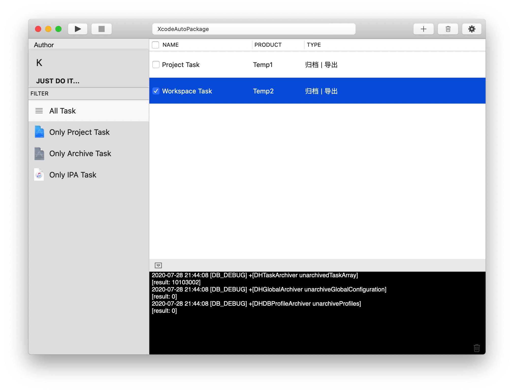

# XcodeAutoPackage

[XcodeAutoPackage_English](README_EN.md)

MacOS 自动化打包ipa，上传至蒲公英、fir，自动化xcarchive导包，解析/修改/保存Xcode工程配置

### 核心功能

- 集Git、Cocoapods、Archive、Export、Distribute一条龙服务
- 自动化打包Xcode工程
  - 自动解析工程信息
  - 可预自定义工程设置（info.plist, .pbxproj=>...=>buildSettings）
  - 自动解析git配置及支持git切换分支
  - 支持Cocoapods安装依赖（pod install）
- 自动解析描述文件信息
- 自动化解析Xcarchive导出.ipa文件
- 自动化上传第三方分发平台（目前可支持pgyer, fir.im）
- 可多选任务串行并发

### 效果图

### TODO:

- [ ] 使用手册

- [ ] UML图

- [ ] 修复打印日志导致的cpu暴增

### 更新日志

#### 2020年8月2日

- 集成并优化核心代码为SDK
- 简化日志系统，新增verbose控制
- 优化添加任务时使用不明确
- 修复全局设置点击选路径无反应

#### 2020年7月28日 v1.0

- 初版完成，全功能跑通
- 可解析/修改/添加pbxproj, info.plist属性
- 自动解析`~/Library/MobileDevice/Provisioning Profiles`下所有.mobileprovision文件
- 筛选、运行、添加、停止、删除任务
- 全局设置
- 日志系统

#### 2020年6月13日

- 项目开始规划写码

感谢[PBXProjectManager](https://github.com/JinhuiLu/PBXProjectManager)作者，提供oc解析pbxproj思路~

如果你觉得还不错，就赞一个啦~ 谢谢！

[MIT LICENSE](LICENSE)
