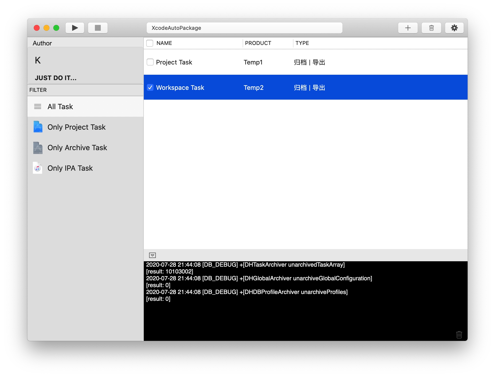

# XcodeAutoPackage

MacOS Xcode automated packaging ipa, uploading to distrubution platform(pgyer, fir), automated xcarchive export ipa, analyzing/modifying/saving Xcode project configuration

### Core Features

- Integrated service of Git, Cocoapods, Archive, Export, and Distribute

- Automated packaging of Xcode projects

  - Automatically analyze project information
  - Pre-define project settings (info.plist, .pbxproj=>...=>buildSettings)

  - Automatically parse git configuration and support git switch branch

  - Support Cocoapods installation dependency (pod install)

- Automatically parse description file information

- Automatically parse Xcarchive export .ipa files
- Automatic uploading to third-party distribution platforms (support pgyer, fir.im currently)
- Multiple tasks can be selected concurrently

### Effect picture

### Guide line

> I will write it if I have time...

### TODO:

- [ ] Guide line

- [ ] UML

- [ ] Fix the CPU surge caused by printing logs

### Update log

#### August 2, 2020

- Integrate and optimize the core code as SDK
- Simplify the log system, add verbose control
- Optimize unclear usage when adding tasks
- Fix global settings, click to select path, no response

#### July 28, 2020 v1.0

- The first version is completed, and all functions run through
- Can parse/modify/add pbxproj, info.plist attributes
- Automatically parse all .mobileprovision files under `~/Library/MobileDevice/Provisioning Profiles`
- Filter, run, add, stop, delete tasks
- Global Settings
- Logging system

#### June 13, 2020

- Project planning and coding

Thanks to the author of [PBXProjectManager](https://github.com/JinhuiLu/PBXProjectManager) for providing oc analysis pbxproj ideas~

If you think it's not bad, just like it~ Thank you!

I heard you want to buy me a cup of coffee? Then you know~ Thank you!